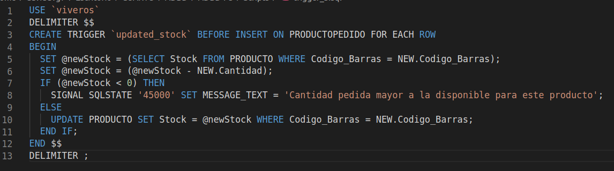

# Práctica 5
## Administración y Diseño de Bases de Datos
### David Valverde Gómez

### 1.  Dada la base de dato de viveros:

-   **Procedimiento:  `crear_email` devuelva una dirección de correo electrónico con el siguiente formato:**

-   **Un conjunto de caracteres del nombe y/o apellidos**
-   **El carácter `@`.**
-   **El dominio pasado como parámetro.**

**Una vez creada la tabla escriba **un trigger** con las siguientes características:**

-   **Trigger: `trigger_crear_email_before_insert`**
    -   **Se ejecuta sobre la tabla clientes.**
    -   **Se ejecuta _antes_ de una operación de _inserción_.**
    -   **Si el nuevo valor del email que se quiere insertar es `NULL`, entonces se le creará automáticamente una dirección de email y se insertará en la tabla.**
    -   **Si el nuevo valor del email no es `NULL` se guardará en la tabla el valor del email.**

**Nota: Para crear la nueva dirección de email se deberá hacer uso del procedimiento `crear_email`.**

En primer lugar, se ha creado el *procedimiento crear_email* aplicado a la base de datos de viveros. Este procedimiento recibirá por parámetro el nombre del usuario, el dominio del correo y una variable en la que se almacenará el correo final, formado por el nombre, el símbolo '@' y el dominio indicado. El script resultante es el siguiente:

A continuación, se ha creado el trigger *trigger_crear_email_before_insert* que se ejecuta antes de realizar una inserción sobre la tabla CLIENTE y que comprueba si en dicha inserción se introduce un correo electrónico. En caso contrario, se vale del método *crear_email* para crear uno a partir del nombre del Cliente y del dominio indicado (en este caso es 'ull.edu.es').

Un ejemplo de su ejecución:

### 2. Crear un trigger permita verificar que las personas en el Municipio del catastro no pueden vivir en dos viviendas diferentes.

Este trigger simplemente verificará que ninguna entrada de la tabla PERSONA tenga campos relativos a una vivienda unifamiliar y a un piso que sean no nulos de manera simultánea:

Ejemplo de ejecución:

### 3. Crear el o los trigger que permitan mantener actualizado el stock de la base de dato de viveros.

Este trigger relativo a la base de datos de viveros actuará antes de cada inserción sobre la tabla PRODUCTOPEDIDO, de manera que cuando se agregue cierta cantidad de un producto a un pedido, esta cantidad se reste al stock actual de dicho producto almacenado en la tabla PRODUCTO. Teniendo siempre en cuenta que no se puede tener un stock negativo para un producto.

Ejemplo de ejecución:

